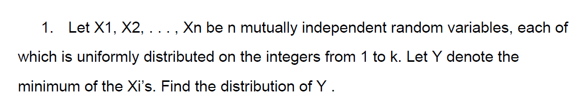
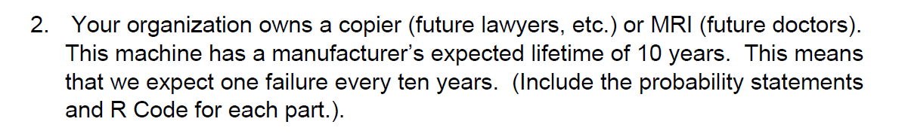
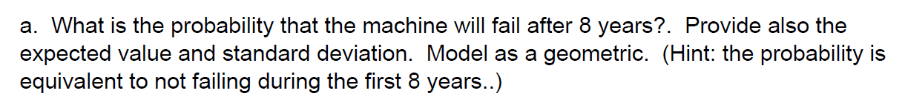
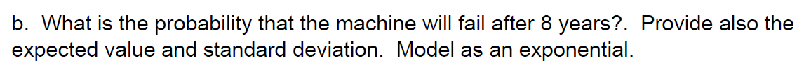
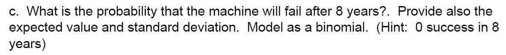

Distribution function where $Y$ is minumum value of $X_i$, $Y = min\{X_i, X_2, X_3, ..., X_n\}$

$Probability~ that~ an~ event(Y)~ occurs = \frac{size~ of~ the~ event~ space}{size~ of~ the~ sample~ space}$

Let $x = \{1, 2, 3, 4, 5, 6\}$, all the integers are _uniformaly distributed_, in other words, all integers have equal chances to be selected. Each integer has $6$ possibilities to be chosen.

If we extract $10$ sample integers from $x$ with replacement then $size~ of~ sample~ space~ =6^{10}$.

*Experiment: 1*

Assume all $10$ samples resulted in the selection of value $1$, which is minimum in the set.

$size~ of~ the~ event~ space = (size~ of~ the~ sample~ space) - (size~ of~ the~ event~ space~ that~ cannot~ happen)$. In this case if $1$ is selected in every sample then events $\{2, 3, 4, 5, 6\}$ cannot happen in $10$ samples 

$size~ of~ the~ event~ space~ that~ cannot~ happen: 5^{10}$

$size~ of~ the~ event~ space(Y = 1) = (size~ of~ the~ sample~ space) - (size~ of~ the~ event~ space~ that~ cannot~ happen)$

$size~ of~ the~ event~ space(Y = 1) = (6^{10} - 5^{10})$, same can be rewritten as,

$(Y = 1) = ((6 -1 +1)^{10} - (6-1)^{10})$

$(Y = 1) = ((6 -0)^{10} - (6-1)^{10})$

*Experiment: 2*

Assume all $10$ samples resulted in the selection of value $2$, which is not the minimum in the set.

$size~ of~ the~ event~ space = (size~ of~ the~ sample~ space) - (size~ of~ the~ event~ space~ that~ cannot~ happen)$. In this case if $2$ is selected in every sample then events $\{3, 4, 5, 6\}$ cannot happen and also event $\{1\}$ cannot happen.

$size~ of~ the~ event~ space~ that~ cannot~ happen: 4^{10} + size~ of~ the~ sample~ space(Y = 1)$

$size~ of~ the~ event~ space~ that~ cannot~ happen: 4^{10} + ((6 -1 +1)^{10} - (6-1)^{10})$

$size~ of~ the~ event~ space(Y = 2) = (size~ of~ the~ sample~ space) - (size~ of~ the~ event~ space~ that~ cannot~ happen)$

$size~ of~ the~ event~ space(Y = 2) = (6^{10} - (4^{10} + ((6 -1 +1)^{10} - (6-1)^{10}))$, same can be rewritten as,

$(Y = 2) = ((6 -1 +1)^{10} - ((6 - 2)^{10} + ((6 -1 +1)^{10} - (6-1)^{10})))$

$(Y = 2) = ((6-1)^{10} - (6 - 2)^{10})$

*Experiment: 3*

Assume all $10$ samples resulted in the selection of value $3$, which is not the minimum in the set.

$size~ of~ the~ event~ space = (size~ of~ the~ sample~ space) - (size~ of~ the~ event~ space~ that~ cannot~ happen)$. In this case if $3$ is selected in every sample then events $\{4, 5, 6\}$ cannot happen and also event $\{1\}$ and $\{2\}$ cannot happen.

$size~ of~ the~ event~ space~ that~ cannot~ happen: 3^{10} + size~ of~ the~ sample~ space(Y = 2) + size~ of~ the~ sample~ space(Y = 1)$

$size~ of~ the~ event~ space~ that~ cannot~ happen: (6-3)^{10} + size~ of~ the~ sample~ space(Y = 2) + size~ of~ the~ sample~ space(Y = 1)$

$size~ of~ the~ event~ space~ that~ cannot~ happen: (6-3)^{10} + ((6 -1 +1)^{10} - ((6 - 2)^{10} + ((6 -1 +1)^{10} - (6-1)^{10}))) + ((6 -1 +1)^{10} - (6-1)^{10})$

$size~ of~ the~ event~ space(Y = 3) = (size~ of~ the~ sample~ space) - (size~ of~ the~ event~ space~ that~ cannot~ happen)$

$size~ of~ the~ event~ space(Y = 3) = (6^{10} - ((6-3)^{10} + ((6 -1 +1)^{10} - ((6 - 2)^{10} + ((6 -1 +1)^{10} - (6-1)^{10}))) + ((6 -1 +1)^{10} - (6-1)^{10}))$, same can be rewritten as,

$(Y = 3) = ((6-2)^{10} - (6 - 3)^{10})$

If experiment is continued to $n$ times, where $j$ is the _minimum integer_ selected then $size~ of~ the~ event~ space(Y = j)$ can be generalized as

$size~ of~ the~ event~ space(Y = j) = ((6-j+1)^{n} - (6 - j)^{n})$

Further, if we have $k$ integers in $x$, $x = \{1,2,3,4,5,6, ...., j,k\}$ then

$size~ of~ the~ event~ space(Y = j) = ((k-j+1)^{n} - (k - j)^{n})$ and $size~ of~ the~ sample~ space =k^n$

Finally, it leads to

$Probability~ that~ an~ event(Y = j)~ occurs = \frac{((k-j+1)^{n} - (k - j)^{n})}{k^n}$

To conclude, as minimum value $j$ increases prabability decreases.

Using _R code_ we can prove,

```{r, echo=T}
library(knitr)
par(mfrow=c(3,2))
options(scipen = 10, digits = 22)

#define x, values (1 to 6)
x <- 1:6

#maximum value, defination of k
k <- max(x)

#initiate out matrix
output <- matrix(NA, nrow=6, ncol=4)

#run 6 experiments
for (e in 1:6){
  events <- rep(NA, 10)
  
  #for each experiment select 10 random values
  #for every incremental experiment remove earlier minimum value
  for (i in 1:15){
    v <- x[x>=e]
    if(e<6){
      events[i] <- sample(v, 1, replace = T)
    }
    else{
          events[i] <- sample(c(min(v),max(v)), 1, replace = T)
    }
  }
  j = min(events)
  n = i
  #populate output table
  output[e,1] <- e
  output[e,2] <- j
  output[e,3] <- paste(as.character(events), collapse=", ")
  output[e,4] <- (((k-j+1)^n) - ((k-j)^n))/(k^n)
  
  hist(events, prob=TRUE, ylim=c(0,2), main = '', xlab = '')
}

#display output table
kable(output, col.names = c("Experiment", "Minimum Value", "Random Values", "Probability"), align = "l", digits = 22)
```

Reason probability of $3$ is lower than $1$ or $2$ is because, as sample size increases, there is higher chance of event $1$ occuring. If event $1$ does not happen in a given sample, it means results are skewed due to violation of uniform distribution rule.



If a copier machine fails every ten years. In this case failure is considered as success$(p) = \frac{1}{10} = `r 1/10`$. Probability machine runs successfully, failure$(1-p) = (1-`r 1/10`) = `r 1 - (1/10)`$



Using _Geometric Distribution_ $p(n) = (1-p)^{n-1}*p$, probability that copier will be working _or_ fail after $8$ years is,

```{r, echo=T}
#number of trials
i = 9
#failure rate of copier(success)
s = 1/10
#copier working(failure)
f = 1 - s

output = 0
trials <- rep(NA, i)
for (n in 1:i){
  #add probability after every failure
  output = output + (f^(n-1)*s)
  trials[n] <- output
}
names(trials) <- 1:i

#barplot(trials, main="Copier Probability of Failure", names.arg=c(names(trials)), ylab="Probability", xlab="Years")
trials = 1 - trials
barplot(trials, main="Probability Copier Will be Working - Geometric Distribution", names.arg=c(names(trials)), ylab="Probability", xlab="Number of Years(Trials)")
```

Probability copier will be working after 8 years: `r round(trials[9]*100,2)`

Probability copier will stop working(fail) after 8 years: `r round((1 - trials[9])*100,2)`

Using _R_ function,

```{r, echo=T}
#using R function pgeom
p <- pgeom(8, s, lower.tail = F)

#probability will copier will fail
p = 1 -p

#expected value,also known as mean 
#s is probabity of copier failure
m <- round(1/s,2)

#standard deviation
sd <- round(sqrt((1-s)/(s^2)),2)

```

Probability copier will be working after 8 years: `r round((1 - p)*100,2)`

Probability copier will stop working(fail) after 8 years: `r round(p*100,2)`

Expected value, also know as mean: $\mu = \frac{1}{p} = \frac{1}{`r s`}$ = `r m`, number of years before copier would stop working(fail).

Standard deviation: $\sigma = \sqrt{\frac{1 - p}{p^2}} = \sqrt{\frac{1 - {`r s`}}{{`r s`}^2}}$ = `r sd`



Using _Exponential Distribution_ $p(n) = e^{{-\lambda}x}$, probability that copier will be working _or_ fail after $8$ years is,

```{r, echo=T}
#number of trials
i = 8
#failure rate of copier(success)
s = 1/10
#copier working(failure)
f = 1 - s

output = 0
trials <- rep(NA, i)
for (n in 1:i){
  #add probability after every failure
  output = exp(-1*s*n)
  trials[n] <- output
}
names(trials) <- 1:i

#barplot(trials, main="Copier Probability of Failure", names.arg=c(names(trials)), ylab="Probability", xlab="Years")
barplot(trials, main="Probability Copier Will be Working - Exponential Distribution", names.arg=c(names(trials)), ylab="Probability", xlab="Number of Years(Trials)")
```

Probability copier will be working after 8 years: `r round(trials[8]*100,2)`

Probability copier will stop working(fail) after 8 years: `r round((1 - trials[8])*100,2)`

Using _R_ function,

```{r, echo=T}
#using R function pexp
p <- pexp(8, s, lower.tail = F)

#probability will copier will fail
p = 1 -p

#expected value,also known as mean 
#s is probabity of copier failure, lambda
m <- round(1/s,2)

#standard deviation
#in expontential distribution standard deviation = mean
sd <- m

```

Probability copier will be working after 8 years: `r round((1 - p)*100,2)`

Probability copier will stop working(fail) after 8 years: `r round(p*100,2)`

Expected value, also know as mean: $\beta = \frac{1}{\lambda} = \frac{1}{`r s`}$ = `r m`, number of years before copier would stop working(fail).

Standard deviation: $\sigma = \lambda$ = `r sd`




Using _Binomial Distribution_ $p(n) = {n\choose k}p^k(1-p)^{n-k}$, probability that copier will be working _or_ fail after $8$ years is,

```{r, echo=T}
#number of trials
i = 8
#failure rate of copier(success)
s = 1/10
#copier working(failure)
f = 1 - s

output = 0
trials <- rep(NA, i)
for (n in 1:i){
  #add probability after every failure
  output = choose(n,0)*(s^0)*(f^(n-0))
  trials[n] <- output
}
names(trials) <- 1:i

#barplot(trials, main="Copier Probability of Failure", names.arg=c(names(trials)), ylab="Probability", xlab="Years")
barplot(trials, main="Probability Copier Will be Working - Binomial Distribution", names.arg=c(names(trials)), ylab="Probability", xlab="Number of Years(Trials)")
```

Probability copier will be working after 8 years: `r round(trials[8]*100,2)`

Probability copier will stop working(fail) after 8 years: `r round((1 - trials[8])*100,2)`

Using _R_ function,

```{r, echo=T}
#using R function pbinom
p <- pbinom(0, size=8, prob=0.1)

#probability will copier will fail
p = 1 -p

#expected value,also known as mean 
#s is probabity of copier failure(p)
#i is number of years(n)
m <- round(i * s,2)

#standard deviation
#square root of mean * (1-p)
sd <- sqrt(m * f)

```

Probability copier will be working after 8 years: `r round((1 - p)*100,2)`

Probability copier will stop working(fail) after 8 years: `r round(p*100,2)`

Expected value, also know as mean: $\mu = np = `r i` * `r s`$ = `r m`, number of years before copier would stop working(fail).

Standard deviation: $\sigma = \sqrt{np(1 - p)} = \sqrt{`r i` * `r s`(1 - `r f`)}$ = `r round(sd,2)`

Using _Poisson Distribution_ $p(observe~ k~ events) = \frac{(e^{-\lambda})(\lambda{^k})}{k!}$, probability that copier will be working _or_ fail after $8$ years is,

```{r, echo=T}
#number of trials
x = 8
#mean or average failure rate of copier(success) in 8 years
k = 0
#probability of failure 
p = 1/10

output = 0
trials <- rep(NA, i)
for (n in 1:x){
  #add probability after every failure
  #lambda = number of years * probability of failure
  l = n * p
  output = (exp(-1 * l)*(l^k))/factorial(k)
  trials[n] <- output
}
names(trials) <- 1:i
#trials = 1 - trials
#barplot(trials, main="Copier Probability of Failure", names.arg=c(names(trials)), ylab="Probability", xlab="Years")
barplot(trials, main="Probability Copier Will be Working - Poisson Distribution", names.arg=c(names(trials)), ylab="Probability", xlab="Number of Years(Trials)")
```

Probability copier will be working after 8 years: `r round(trials[8]*100,2)`

Probability copier will stop working(fail) after 8 years: `r round((1 - trials[8])*100,2)`

Using _R_ function,

```{r, echo=T}
#lambda = years * probability of failure
l = x * p
#using R function ppois
pp <- ppois(0, lambda = l)

#probability will copier will fail
pp = 1 -pp

#expected value,also known as mean 
#s is probabity of copier failure(p)
#i is number of years(n)
m <- round(l,2)

#standard deviation
#square root of mean
sd <- sqrt(m)

```

Probability copier will be working after 8 years: `r round((1 - pp)*100,2)`

Probability copier will stop working(fail) after 8 years: `r round(pp*100,2)`

Expected value, also know as mean: $\lambda = np = `r x` * `r p`$ = `r m`, number of years before copier would stop working(fail).

Standard deviation: $\sigma = \sqrt{\lambda} = \sqrt{`r m`}$ = `r round(sd,2)`


References:

- https://math.dartmouth.edu/archive/m20f10/public_html/HW5Solutions.pdf
- https://drive.google.com/file/d/0B-DHaDEbiOGkc1RycUtIcUtIelE/view - OpenIntro Statistics 
- http://www.r-tutor.com/elementary-statistics/probability-distributions/exponential-distribution

